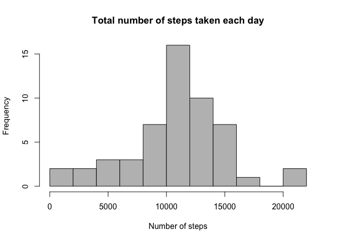
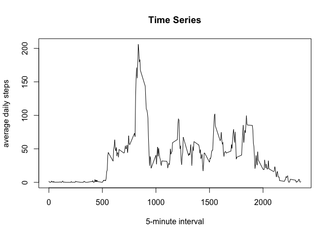
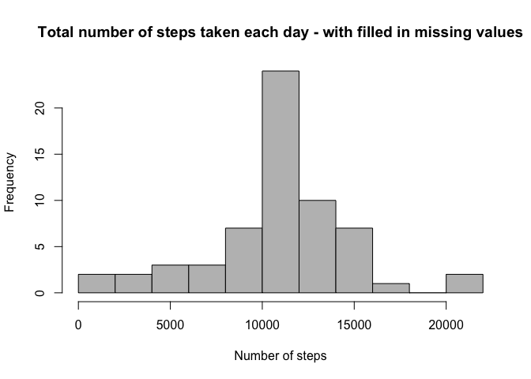
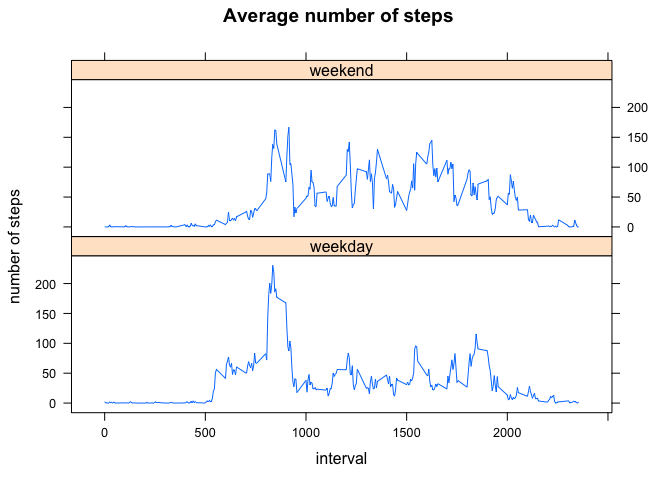

## Introduction  
This project is part of the "Reproducible Research" course.  
This assignment makes use of data from a personal activity monitoring device. This device collects data at 5 minute intervals through out the day. The data consists of two months of data from an anonymous individual collected during the months of October and November, 2012 and include the number of steps taken in 5 minute intervals each day.  

## Loading and preprocessing the data  
1.**Load the data**

```r
activity <- read.csv("activity.csv")
```
*checking the data:

```r
head(activity)
```

```
##   steps       date interval
## 1    NA 2012-10-01        0
## 2    NA 2012-10-01        5
## 3    NA 2012-10-01       10
## 4    NA 2012-10-01       15
## 5    NA 2012-10-01       20
## 6    NA 2012-10-01       25
```

```r
str(activity)
```

```
## 'data.frame':	17568 obs. of  3 variables:
##  $ steps   : int  NA NA NA NA NA NA NA NA NA NA ...
##  $ date    : Factor w/ 61 levels "2012-10-01","2012-10-02",..: 1 1 1 1 1 1 1 1 1 1 ...
##  $ interval: int  0 5 10 15 20 25 30 35 40 45 ...
```
2.**Process the data**

```r
activity$date <- as.Date(activity$date, format = "%Y-%m-%d")
```
## What is mean total number of steps taken per day?
1.**Calculate the total number of steps taken per day**

```r
stepsPerDay <- aggregate(steps ~ date, FUN = sum, data = activity, na.rm = TRUE)
head(stepsPerDay)
```

```
##         date steps
## 1 2012-10-02   126
## 2 2012-10-03 11352
## 3 2012-10-04 12116
## 4 2012-10-05 13294
## 5 2012-10-06 15420
## 6 2012-10-07 11015
```

```r
tail(stepsPerDay)
```

```
##          date steps
## 48 2012-11-24 14478
## 49 2012-11-25 11834
## 50 2012-11-26 11162
## 51 2012-11-27 13646
## 52 2012-11-28 10183
## 53 2012-11-29  7047
```
2.**Make a histogram of the total number of steps taken each day**

```r
hist(stepsPerDay$steps, breaks = 10, xlab = "Number of steps", main = "Total number of steps taken each day", col = "gray")
```

<!-- -->

3.**Calculate and report the mean and median of the total number of steps taken per day**

```r
meanOfTotalSteps <- mean(stepsPerDay$steps)
meanOfTotalSteps
```

```
## [1] 10766.19
```

```r
medianOfTotalSteps <- median(stepsPerDay$steps)
medianOfTotalSteps
```

```
## [1] 10765
```
## What is the average daily activity pattern?  
1.**Make a time series plot (i.e. 𝚝𝚢𝚙𝚎 = "𝚕") of the 5-minute interval (x-axis) and the average number of steps taken, averaged across all days (y-axis)**  

```r
averageDailySteps <- aggregate(steps ~ interval, FUN = mean, data = activity,na.rm = TRUE)
plot (averageDailySteps$interval, averageDailySteps$steps, type = "l", xlab = "5-minute interval", ylab = "average daily steps", main = "Time Series")
```

<!-- -->

2.**Which 5-minute interval, on average across all the days in the dataset, contains the maximum number of steps?**  

```r
averageDailySteps$interval[which.max(averageDailySteps$steps)]
```

```
## [1] 835
```
## Imputing missing values
1.**Calculate and report the total number of missing values in the dataset (i.e. the total number of rows with 𝙽𝙰s)**

```r
sum(is.na(activity))
```

```
## [1] 2304
```
2.**Devise a strategy for filling in all of the missing values in the dataset.**  
Method: mean of 5-minute interval

3.**Create a new dataset that is equal to the original dataset but with the missing data filled in.**

```r
newActivity <- activity
for (i in averageDailySteps$interval) {
        newActivity[newActivity$interval == i & is.na(newActivity$steps), ]$steps <- 
                averageDailySteps$steps[averageDailySteps$interval == i]
}
```
4.**Make a histogram of the total number of steps taken each day and Calculate and report the mean and median total number of steps taken per day. **

```r
newStepsPerDay <- aggregate(steps ~ date, FUN = sum, data = newActivity, na.rm = TRUE)
hist(newStepsPerDay$steps, breaks = 10, xlab = "Number of steps", main = "Total number of steps taken each day - with filled in missing values", col = "gray")
```

<!-- -->

```r
meanOfNewTotalSteps <- mean(newStepsPerDay$steps)
meanOfNewTotalSteps
```

```
## [1] 10766.19
```

```r
medianOfNewTotalSteps <- median(newStepsPerDay$steps)
medianOfNewTotalSteps
```

```
## [1] 10766.19
```
**Do these values differ from the estimates from the first part of the assignment?**  
The mean still the same, althought the median is slightly different.  

**What is the impact of imputing missing data on the estimates of the total daily number of steps?**  
Filling in the missed values with the mean of 5-minute interval results in a distribution with smaller variation.  

## Are there differences in activity patterns between weekdays and weekends?
1.**Create a new factor variable in the dataset with two levels – “weekday” and “weekend” indicating whether a given date is a weekday or weekend day.**

```r
newActivity$weekdays <- as.factor(ifelse(weekdays(newActivity$date) %in% c("Saturday", "Sunday"), "weekend", "weekday"))
```
2.**Make a panel plot containing a time series plot (i.e. 𝚝𝚢𝚙𝚎 = "𝚕") of the 5-minute interval (x-axis) and the average number of steps taken, averaged across all weekday days or weekend days (y-axis).**

```r
library(lattice)
```

```
## Warning: package 'lattice' was built under R version 3.2.5
```

```r
activityDays <- aggregate(steps ~ weekdays + interval, FUN = mean, data = newActivity)
xyplot(steps ~ interval | weekdays, activityDays, type = "l", layout = c(1,2), xlab = "interval", ylab = "number of steps", main = " Average number of steps")
```

<!-- -->

